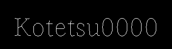

+++
title = '【Cython】PythonのNWG細線化の高速化'
date = 2024-07-10T11:07:27+09:00
description = "PythonでNWG細線化のコードを作成したので、Cythonで高速化を行なった。"
categories = ["Python", "Image Processing"]
tags = ["Python", "Image Processing"]
+++

[前回](/post/nagendraprasad_wang_gupta_thinning_algorithm_python/)、Numpyを利用したNWG法の実装を行なった。今回はこれを高速化していく。

## Cython

Pythonを高速化する上では様々な方法があるように思う。Numpyを使用するのもその一例であるが、それ以外にはC言語のコードを呼び出すというものがある。

C、C++のバインディングライブラリとしては、pybind11やCythonなどが挙げられる。今回は既にPythonに存在するコードを書き換えるのでCythonを利用した。

## 元のコード

まずは前回作成したPythonのコードである。

```python
import numpy as np

def NWG(img:np.ndarray, symmetric:bool=False) -> np.ndarray:
    src = np.copy(img)//255

    # zero padding
    ROW, COLUMN = src.shape[0]+2, src.shape[1]+2
    pad = np.zeros((ROW, COLUMN))
    pad[1:ROW-1, 1:COLUMN-1] = src
    src = pad

    switch = True
    while True:
        r, c = src.nonzero()
        nei = np.array((src[r-1, c], src[r-1, c+1], src[r, c+1],
                        src[r+1, c+1], src[r+1, c], src[r+1, c-1],
                        src[r, c-1], src[r-1, c-1]))

        # condition 1
        nei_sum = np.sum(nei, axis=0)
        cond1 = np.logical_and(2 <= nei_sum, nei_sum <= 6)

        # condition 2
        nei = np.concatenate([nei, np.array([nei[0]])], axis=0)
        cond2 = np.zeros(nei.shape[1], dtype=np.uint8)
        for i in range(1, 9):
            cond2 += np.array(
                np.logical_and(nei[i-1] == 0, nei[i] == 1), dtype=np.uint8)
        cond2 = cond2 == 1
        nei = nei[0:8]

        # condition 3
        if symmetric:
            if switch:
                c3a = np.logical_and(
                    nei[0]+nei[1]+nei[2]+nei[5] == 0, nei[4]+nei[6] == 2)
                c3b = np.logical_and(
                    nei[2]+nei[3]+nei[4]+nei[7] == 0, nei[0]+nei[6] == 2)
                cond3 = np.logical_or(c3a, c3b)
            else:
                c3c = np.logical_and(
                    nei[1]+nei[4]+nei[5]+nei[6] == 0, nei[0]+nei[2] == 2)
                c3d = np.logical_and(
                    nei[0]+nei[3]+nei[6]+nei[7] == 0, nei[2]+nei[4] == 2)
                cond3 = np.logical_or(c3c, c3d)
        else:
            c3a = np.logical_and(
                nei[0]+nei[1]+nei[2]+nei[5] == 0, nei[4]+nei[6] == 2)
            c3b = np.logical_and(
                nei[2]+nei[3]+nei[4]+nei[7] == 0, nei[0]+nei[6] == 2)
            cond3 = np.logical_or(c3a, c3b)    

        # condition 4
        if switch:
            cond4 = (nei[2]+nei[4])*nei[0]*nei[6] == 0
        else:
            cond4 = (nei[0]+nei[6])*nei[2]*nei[4] == 0

        cond = np.logical_and(cond1, np.logical_or(cond2, cond3))
        cond = np.logical_and(cond, cond4)
        if True in cond:
            switch = not switch
        else:
            return (src[1:ROW-1, 1:COLUMN-1]*255).astype(np.uint8)

        src[r[cond], c[cond]] = 0
```

今回は時間を計測するにあたり、以下のような二値画像を作成した。


これをNWG細線化するとこのようになる。

* Non Symmetric



* Symmetric


時間計測は細線化を100回行ったものを比率で評価する。

Pythonの実装でSymmetricとNon Symmetricの時間を比較した結果は以下に示す。

| Symmetric / Non symmetric | Non symmetric / Symmetric | 
| ------------------------- | ------------------------- | 
| 99.00%                    | 101.01%                   | 

ほとんど同じであった。

## 高速化その1(とりあえずコンパイルしてみる)

CythonではNumpyを使用することができる。そこで、まずは簡単にできることから始める。とりあえずコンパイルしてみた。※コードは同じ

| Cython nofix symmetric / Python symmetric | Cython nofix non symmetric / Python non symmetric | 
| ---------------------------------------- | -------------------------------------------- | 
| 97.05%| 107.77%| 

非常に若干の高速化ができた(?)、誤差の可能性もありそうではあるが特に有意差があるかについては検討しない。

## 高速化その2(型を設定する)

次に、Cythonの高速化として一般的である型の指定を行った。型の指定を行うと以下のようなプログラムになる。

```cython
import numpy as np
cimport numpy as cnp
cimport cython

DTYPE = np.uint8
ctypedef cnp.uint8_t DTYPE_t

@cython.boundscheck(False)
@cython.wraparound(False)
cpdef cnp.ndarray[DTYPE_t, ndim=2] NWG(cnp.ndarray[DTYPE_t, ndim=2] img, int symmetric=False):
    cdef cnp.ndarray[DTYPE_t, ndim=2] src = np.copy(img) // 255
    cdef int ROW = src.shape[0]+2
    cdef int COLUMN = src.shape[1]+2

    cdef cnp.ndarray[DTYPE_t, ndim=2] pad = np.zeros((ROW, COLUMN), dtype=DTYPE)

    cdef cnp.ndarray[DTYPE_t, ndim=2] nei
    cdef tuple temp
    cdef cnp.ndarray[cnp.int64_t, ndim=1] r, c
    cdef cnp.ndarray[cnp.uint8_t, ndim=1] nei_sum
    cdef cnp.ndarray[DTYPE_t, ndim=1] cond1, cond2, c3a, c3b, c3c, c3d, cond3, cond4, cond
    cdef DTYPE_t switch = True

    pad[1:ROW-1, 1:COLUMN-1] = src
    src = pad
    
    while True:
        r, c = src.nonzero()
        nei = np.array((src[r-1, c], src[r-1, c+1], src[r, c+1],
                        src[r+1, c+1], src[r+1, c], src[r+1, c-1],
                        src[r, c-1], src[r-1, c-1]))

        # condition 1
        nei_sum = np.sum(nei, axis=0, dtype=DTYPE)
        cond1 = np.logical_and(2 <= nei_sum, nei_sum <= 6)

        # condition 2
        nei = np.concatenate([nei, np.array([nei[0]])], axis=0)
        cond2 = np.zeros(nei.shape[1], dtype=DTYPE)
        for i in range(1, 9):
            cond2 += np.array(
                np.logical_and(nei[i-1] == 0, nei[i] == 1), dtype=np.uint8)
        cond2 = cond2 == 1
        nei = nei[0:8]

        # condition 3
        if symmetric:
            if switch:
                c3a = np.logical_and(
                    nei[0]+nei[1]+nei[2]+nei[5] == 0, nei[4]+nei[6] == 2)
                c3b = np.logical_and(
                    nei[2]+nei[3]+nei[4]+nei[7] == 0, nei[0]+nei[6] == 2)
                cond3 = np.logical_or(c3a, c3b)
            else:
                c3c = np.logical_and(
                    nei[1]+nei[4]+nei[5]+nei[6] == 0, nei[0]+nei[2] == 2)
                c3d = np.logical_and(
                    nei[0]+nei[3]+nei[6]+nei[7] == 0, nei[2]+nei[4] == 2)
                cond3 = np.logical_or(c3c, c3d)
        else:
            c3a = np.logical_and(
                nei[0]+nei[1]+nei[2]+nei[5] == 0, nei[4]+nei[6] == 2)
            c3b = np.logical_and(
                nei[2]+nei[3]+nei[4]+nei[7] == 0, nei[0]+nei[6] == 2)
            cond3 = np.logical_or(c3a, c3b)

        # condition 4
        if switch:
            cond4 = (nei[2]+nei[4])*nei[0]*nei[6] == 0
        else:
            cond4 = (nei[0]+nei[6])*nei[2]*nei[4] == 0

        cond = np.logical_and(cond1, np.logical_or(cond2, cond3))#1<b<7 and (a==1 or c==1)
        cond = np.logical_and(cond, cond4)
        if True in cond:
            switch = not switch
        else:
            return src[1:ROW-1, 1:COLUMN-1]*255

        src[r[cond], c[cond]] = 0
```

| Cython symmetric / Python symmetric | Cython non symmetric / Python non symmetric | 
| ----------------------------------- | ------------------------------------------- | 
| 66.76%| 69.03%| 

Pythonからおよそ2/3の時間まで高速化できた。これだけでも十分な高速化ができたと思う。

## 高速化その3(Numpyを使用しない)

最後にNumpyを使用しないで高速化を試みた。結果、以下のようなプログラムになった。

```cython
import numpy as np
cimport numpy as cnp
cimport cython

DTYPE = np.uint8
ctypedef cnp.uint8_t DTYPE_t

@cython.boundscheck(False)
@cython.wraparound(False)
cpdef cnp.ndarray[DTYPE_t, ndim=2] NWG(cnp.ndarray[DTYPE_t, ndim=2] img, int symmetric=False):
    cdef cnp.ndarray[DTYPE_t, ndim=2] src = np.pad(np.copy(img) // 255, (1, 1), 'constant')
    cdef cnp.ndarray[DTYPE_t, ndim=2] Q
    cdef int ROW = src.shape[0]
    cdef int COLUMN = src.shape[1]

    cdef int x, y, g, h, i, c, d
    cdef int[9] p
    cdef int cond, cond1, cond2, cond3, cond4
    cdef int cond3a, cond3b, cond3c, cond3d

    # 初期化
    g = 1
    h = 1
    while h==1:
        Q = np.zeros_like(src)
        g = 1 - g
        h = 0

        for x in range(1,COLUMN-1):
            for y in range(1,ROW-1):
                if src[y,x]==1:
                    p[0] = src[y-1, x]
                    p[1] = src[y-1, x+1]
                    p[2] = src[y, x+1]
                    p[3] = src[y+1, x+1]
                    p[4] = src[y+1, x]
                    p[5] = src[y+1, x-1]
                    p[6] = src[y, x-1]
                    p[7] = src[y-1, x-1]
                    p[8] = p[0]

                    # condition 1
                    p_sum = p[0]+p[1]+p[2]+p[3]+p[4]+p[5]+p[6]+p[7]
                    cond1 = 1<p_sum and p_sum<7

                    # condition 2
                    a=0
                    for i in range(1, 9):
                        a += 1 if p[i-1]==0 and p[i]==1 else 0
                    cond2 = a==1

                    # condition 3
                    cond3a = p[0]+p[1]+p[2]+p[5]==0 and p[4]+p[6]==2
                    cond3b = p[2]+p[3]+p[4]+p[7]==0 and p[0]+p[6]==2
                    if symmetric:
                        cond3c = p[1]+p[4]+p[5]+p[6]==0 and p[0]+p[2]==2
                        cond3d = p[0]+p[3]+p[6]+p[7]==0 and p[2]+p[4]==2
                        c = cond3a or cond3b
                        d = cond3c or cond3d
                        cond3 = (1 - g)*c + g*d == 1
                    else:
                        cond3 = cond3a or cond3b
                        

                    # condition 4
                    if g==0:
                        cond4 = (p[2]+p[4])*p[0]*p[6] == 0
                    else:
                        cond4 = (p[0]+p[6])*p[2]*p[4] == 0
                    cond = cond1 and (cond2 or cond3) and cond4

                    if cond:
                        h=1
                    else:
                        Q[y,x]=1
        src = Q    
    return src[1:ROW-1, 1:COLUMN-1]*255
```

| Cython symmetric / Python symmetric | Cython non symmetric / Python non symmetric | 
| ----------------------------------- | ------------------------------------------- | 
| 42.05%| 41.89%| 

先ほどより高速化ができた。Pythonと比較して2倍以上の高速化が達成できた。

## 最後に

今回はCythonを利用してNWG細線化の高速化を行なった。これらの関数は[VitLib](https://github.com/Kotetsu0000/VitLib)で公開している。使用したいだけであればこちらからインストールすれば使用することができるので、よかったらどうぞ。(高速化前と後での出力結果が一致することは確認しています。)

